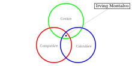

## I'm Irving Montalvo 👋

```haskell
MOIXLLIK := Calculāre -> Computāre -> Creāre -> Irving Montalvo
```

- [x] (2021) **Bachelor's degree**, _Accounting and Finance_.
- [x] (2009) **Bachelor of Technology - BTech**, _Computing and Information Technologies_.

### Programming Languages

| Prototype | Velocity | Research | Database |
| --------- | -------- | -------- | -------- |
| HTML, CSS, JavaScript, Python | ASM, C/C++, Rust | Lambda, Lisp, Haskell | Vectors, CSV, XML, SQL |
